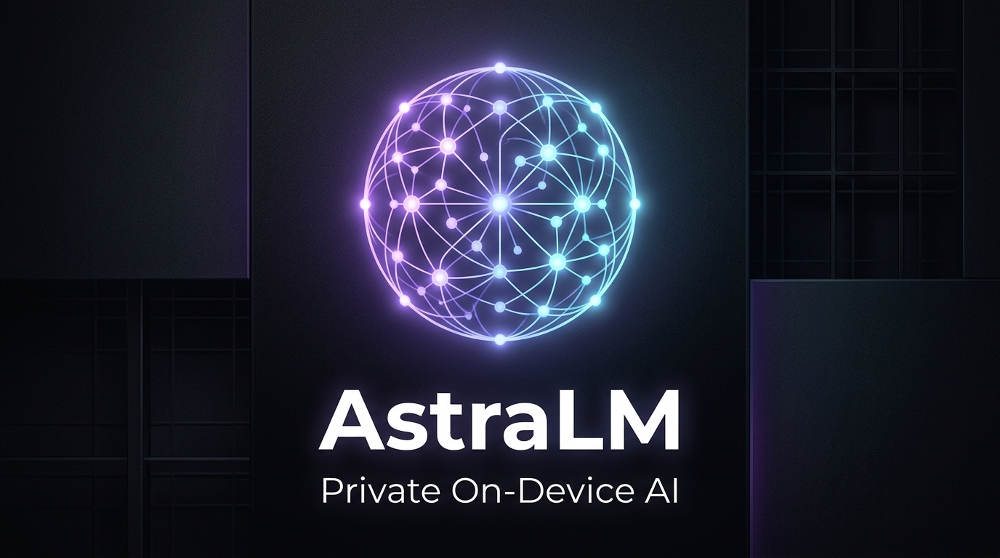

# AstraLM — Private On-Device AI



[](https://flutter.dev)
[](https://android.com)
[](PRIVACY_POLICY.md)
[](LICENSE)

A high-performance, private, on-device AI chat client built with Flutter. AstraLM runs Large Language Models (LLMs) and Vision models 100% locally on device hardware (CPU & GPU) with zero data leaving your phone.

---

## ✨ Features

- **100% Offline & Private** — All conversations, photos, and document analyses stay on your device.
- **Dual High-Performance Engines** — 
  - **GGUF Runtime (`llama.cpp`)**: Accelerated quantized inference (Llama 3, Qwen 2.5, Gemma, Mistral, Phi-3, DeepSeek).
  - **LiteRT-LM (Google LiteRT)**: Hardware-accelerated OpenCL GPU & CPU inference for mobile models.
- **Multimodal Vision** — Analyze photos, documents, and screenshots directly using compatible local vision models.
- **Fluid & Minimalist UI** — 120Hz smooth scrolling, dynamic attached attachment popouts, Open Sans / Manrope typography, and refined dark/light themes.
- **Voice Input** — On-device speech-to-text recognition.
- **Optional Cloud Mode** — Connect your own API keys for OpenAI, Anthropic, Gemini, Groq, OpenRouter, and Stability AI.

---

## 🛠️ Technical Architecture

### Inference Pipeline

```
┌─────────────────────────────────────────────────────────────┐
│                        UI Layer                              │
│   ChatView / TaskView / ModelView / SettingsView            │
└──────────────────────────┬──────────────────────────────────┘
                           │
┌──────────────────────────▼──────────────────────────────────┐
│                    Controllers (GetX)                        │
│   ChatController · TaskController · ModelController         │
│   SettingsController · HomeController                       │
└──────────────────────────┬──────────────────────────────────┘
                           │
┌──────────────────────────▼──────────────────────────────────┐
│                      Services                                │
│  ┌─────────────────┐  ┌─────────────────┐  ┌─────────────┐ │
│  │ InferenceService│  │  CloudService   │  │DownloadSvc  │ │
│  │(GGUF + LiteRT)  │  │(OpenAI/Claude/  │  │ (model dl)  │ │
│  │                 │  │ Gemini/Groq)    │  │             │ │
│  └─────────────────┘  └─────────────────┘  └─────────────┘ │
│  ┌─────────────────┐  ┌─────────────────┐  └─────────────┐ │
│  │  HiveService    │  │ DeviceInfoSvc   │  │ExecutionSvc │ │
│  │  (persistence)  │  │ (RAM/GPU tier)  │  │ (bg tasks)  │ │
│  └─────────────────┘  └─────────────────┘  └─────────────┘ │
└─────────────────────────────────────────────────────────────┘
```

---

## 🚀 Building & Running

### Android Build
```bash
# Debug Build & Run
flutter run

# Production Signed APK
flutter build apk --release

# Production Signed App Bundle (Google Play / Stores)
flutter build appbundle --release
```

---

## 🙏 Credits & Acknowledgments

- **Special Thanks & Credit:** AstraLM is built upon and inspired by the original **[PrivateLM](https://github.com/orailnoor/cross-platform-llm-client)** project by [@orailnoor](https://github.com/orailnoor).
- **Core Engine Credits:**
  - [llama.cpp](https://github.com/ggerganov/llama.cpp) by Georgi Gerganov & contributors.
  - [Google LiteRT (TensorFlow Lite)](https://ai.google.dev/edge/litert).

---

## 📄 License & Privacy

- **License:** MIT License — see [LICENSE](./LICENSE) for details.
- **Privacy Policy:** See [PRIVACY_POLICY.md](./PRIVACY_POLICY.md).

### Local Inference (Android)

The app uses `llama_flutter_android`, a custom Flutter plugin wrapping `llama.cpp` for ARM64 devices. At runtime it:

1. **Detects GPU capabilities** via Vulkan to determine offload layers.
2. **Selects thread count** based on device tier (ultra / high / mid / low).
3. **Loads the GGUF model** with progress streaming.
4. **Generates tokens** via `generateChat()` with native chat-template support (ChatML, Llama-3, Gemma, Phi).
5. **Falls back** to manual prompt construction if native templates fail.

Idle detection (5s) and hard timeouts (180s) keep the UX responsive even on underpowered hardware.

### Cloud Inference

`CloudService` normalizes four different API shapes into a single interface:

- **OpenAI** — standard `/v1/chat/completions`
- **Anthropic** — Messages API with separate system param
- **Google Gemini** — `generateContent` with inline image base64
- **Kimi** — OpenAI-compatible endpoint from Moonshot AI

API keys are stored in Hive and never transmitted anywhere except to the provider's endpoint.

### Cross-Platform Abstraction

Local inference is conditionally compiled:

- **Android** → `inference_android.dart` (full llama.cpp engine)
- **Web** → `inference_stub.dart` (cloud-only, local coming soon)
- **iOS** → `inference_android.dart` (full llama.cpp engine via Metal GPU)

The `InferenceService` exposes `supportsLocalInference` so the UI can hide local-model UI on unsupported platforms.

---

## Supported Platforms

| Platform | Local Inference | Cloud APIs | Notes                           |
| -------- | --------------- | ---------- | ------------------------------- |
| Android  | ✅ Yes          | ✅ Yes     | CPU offload via NEON; minSdk 28 |
| iOS      | ✅ Yes          | ✅ Yes     | Metal GPU acceleration          |
| Web      | ❌ No           | ✅ Yes     | Cloud-only (local coming soon)  |

### iOS / iPad

The iPad release is distributed as a standalone ZIP package for sideloading. Download the latest `AstraLM-iOS.zip` from the [Releases](https://github.com/Prasun01/AstraLM/releases) page, extract it, and install the `.ipa` via AltStore, Sideloadly, or Xcode. iPhone support is experimental — iPad is the recommended iOS target due to RAM requirements for local models.

---

## Build Configuration

### Prerequisites

- Flutter SDK >=3.3.0
- Android SDK (API 26+)
- JDK 17
- NDK (bundled with Android SDK)

### Android

```bash
flutter pub get
flutter build apk --debug
```

Release APKs require a stable signing key. Copy
`android/key.properties.example` to `android/key.properties`, fill in the
keystore values, and keep both the key and its backup. Android accepts an APK
upgrade only when it is signed with the same key as the installed APK.

```bash
cp android/key.properties.example android/key.properties
flutter build apk --release --split-per-abi
```

Never rotate the signing key between GitHub releases. The per-ABI APKs must
also keep increasing the build number in `pubspec.yaml`.

### iOS

```bash
flutter pub get
cd ios
pod install
flutter build ios
```

### Web

```bash
flutter pub get
flutter build web --release
```

---

## License

MIT — see [LICENSE](./LICENSE) for details.
